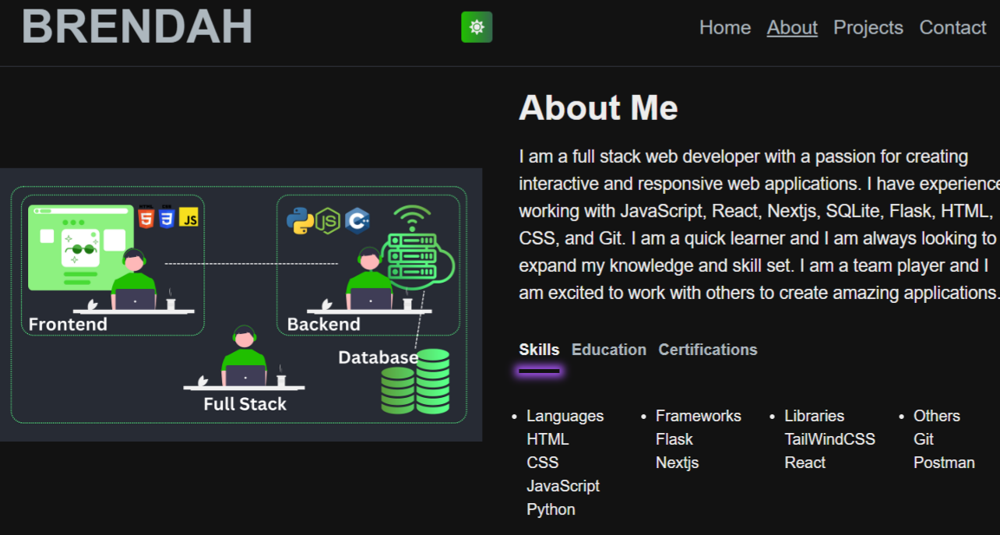

## Hi there, I'm Brendah Kiragu! 👋

I'm a passionate full-stack web developer with a solid foundation in both front-end and back-end technologies. With over 6 months of hands-on experience in building dynamic web applications, I've honed my skills in <strong>JavaScript: React and Nextjs</strong>, and <strong>Python:Flask</strong> for back-end development.
I specialize in crafting efficient, scalable, and user-friendly applications while continuously learning and adapting to new technologies. My journey in tech started with curiosity and a desire to create with code, and it's been an exciting adventure of growth ever since.
Feel free to explore my repositories, and don't hesitate to reach out if you'd like to collaborate or discuss ideas!
Welcome to my world 🌍

When not coding I explore programmers jokes for fun:

## Tech Stack

<table align="center">
  <tr>
    <th>Languages</th>
    <th>Frameworks</th>
    <th>Libraries</th>
    <th>Database Management Sytstems</th>
    <th>Others</th>
  </tr>
  <tr>
    <td>
      <ul>
        <li></li>
        <li></li>
        <li></li>
        <li></li>
      </ul>
    </td>
    <td>
      <ul>
        <li></li>
        <li></li>
      </ul>
    </td>
    <td>
      <ul>
        <li></li>
      </ul>
    </td>
    <td>
      <ul>
        <li></li>
        <li></li>
      </ul>
    </td>
    <td>
      <ul>
        <li></li>
        <li></li>
        <li></li>
      </ul>
    </td>
  </tr>
</table> 

## My GitHub Stats

 
